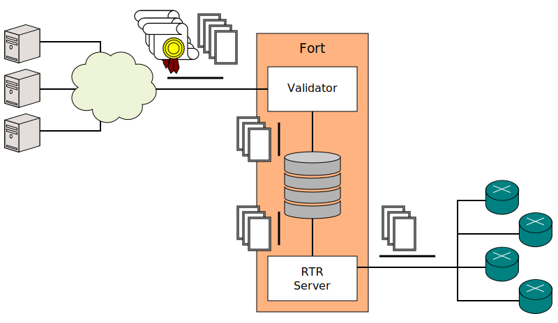

# {{ page.title }}

## Design

Fort is an MIT-licensed RPKI Relying Party. It is a service that performs the validation of the entire RPKI repository, and which serves the resulting ROAs for easy access by your routers.

The Validator is a timer that resynchronizes its [local cache](usage.html#--local-repository), validates the resulting [RPKI trees](intro-rpki.html) and stores the resulting ROAs in memory every [certain amount of time](usage.html#--serverintervalvalidation). The RTR [Server](usage.html#--serveraddress) (which is part of the same binary) delivers these ROAs to any requesting routers.

Fort is a command line application intended for UNIX operating systems, written in C. (It requires a compiler that supports `-std=gnu11`.)

## Standards Compliance 

Further information can be found in the subsections below.

| RFC                                                                        | Implemented |
|----------------------------------------------------------------------------|-------------|
| [3779](https://tools.ietf.org/html/rfc3779) (IP & AS Extensions)           | 100%        |
| [6350](https://tools.ietf.org/html/rfc6350) (vCard)                        | 0%          |
| [6482](https://tools.ietf.org/html/rfc6482) (ROA)                          | 100%        |
| [6486](https://tools.ietf.org/html/rfc6486) (Manifests)                    | 100%        |
| [6487](https://tools.ietf.org/html/rfc6487) (Resource Certificates & CRLs) | 100%        |
| [6488](https://tools.ietf.org/html/rfc6488) (Signed Objects)               | 100%        |
| [6493](https://tools.ietf.org/html/rfc6493) (Ghostbusters)                 | 100%        |
| [6810](https://tools.ietf.org/html/rfc6810) (RTR Version 0)                | 100%        |
| [7318](https://tools.ietf.org/html/rfc7318) (Policy Qualifiers)            | 100%        |
| [7935](https://tools.ietf.org/html/rfc7935) (RPKI algorithms)              | 100%        |
| [8182](https://tools.ietf.org/html/rfc8182) (RRDP)                         | 100%        |
| [8209](https://tools.ietf.org/html/rfc8209) (BGPSec Certificates)          | 100%        |
| [8210](https://tools.ietf.org/html/rfc8210) (RTR Version 1)                | 100%        |
| [8360](https://tools.ietf.org/html/rfc8360) (Validation Reconsidered)      | 100%        |
| [8416](https://tools.ietf.org/html/rfc8416) (SLURM)                        | 100%        |
| [8608](https://tools.ietf.org/html/rfc8608) (BGPsec algorithms)            | 100%        |
| [8630](https://tools.ietf.org/html/rfc8630) (TALs with HTTPS URIs)         | 100%        |

### RFC 6350 (vCard)

The vCard format is only used by Ghostbusters records. 6350 defines the basic vCard format, while 6493 defines additional requirements for Ghostbusters-specific vCard.

The specific validations have been implemented, while the basic ones have not.

## TO-DO

- Reach 100% RFC compliance
- Daemon quirks (stuff like "send self to background automatically"), maybe
