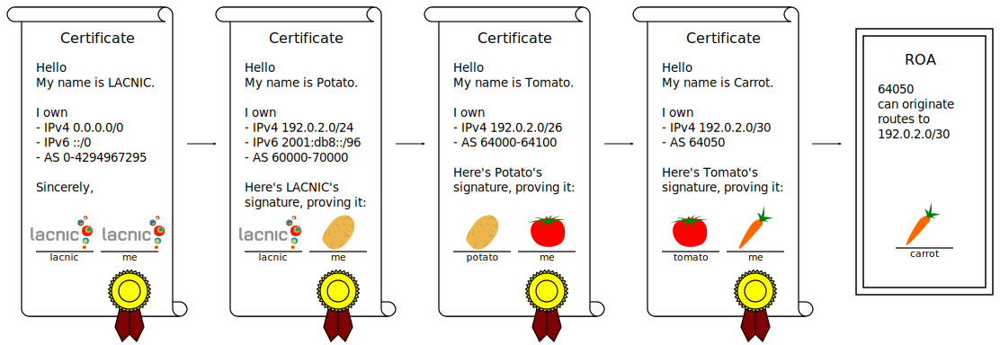
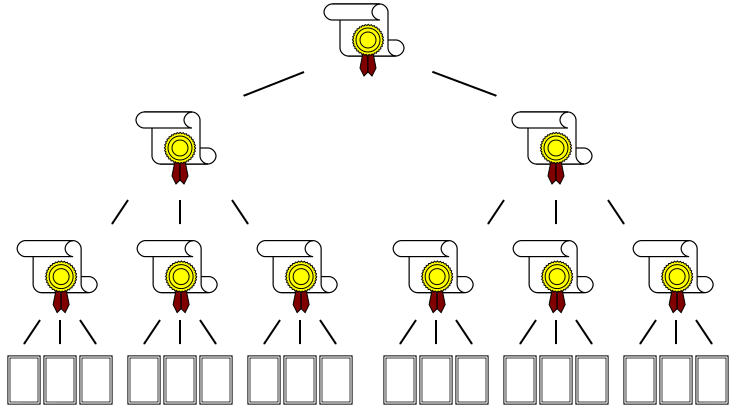

# {{ page.title }}

## Problem Statement

Routing, having been conceived near the inception of networking, was hardly designed with security as a primary concern. As a result, routing protocols (in their vanilla forms) are vulnerable to [several attacks](https://tools.ietf.org/html/rfc4593#section-4).

## Solution

The RPKI (Resource Public Key Infrastructure) is a PKI (Public Key Infrastructure) that deals with Internet Resources. (In this context, "resource" refers to IP Addresses and AS numbers.)

Basically, the idea is that one should be able to verify the origin of a route by following a chain of cryptographically-signed certificates rooted at one of the [RIRs](https://en.wikipedia.org/wiki/Regional_Internet_registry):

The end result is a _Route Origin Attestation_ (ROA), a digitally signed object that provides a means of verifying that an IP address block holder has authorized an Autonomous System (AS) to originate routes to its address block or one of its children's.

So the whole infrastructure functions like a tree-shaped trust network (one for each RIR) in which authorities (_Certificate Authority_--CA) attest to their resource suballocations:

In the RPKI, all of these files are required to be publicly-available, so anyone can verify them.

This is, however, too much work for a router, so the validation work is deferred to a trusted _Relying Party_ (RP). That's where [Fort](intro-fort.html) comes in.
